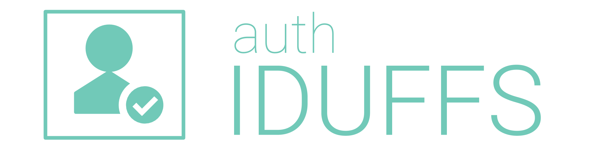

<p align="center">
    <br />
    
    
</p>

# auth-iduffs

Um pacote PHP para autenticação de usuários através do [idUFFS](https://id.uffs.edu.br) da [Universidade Federal da Fronteira Sul](https://www.uffs.edu.br). Além de prover autenticação, ele oferece informações sobre o usuário autenticado, como nome completo, CPF, entre outros.

## ✨Features

* Autenticação com o endpoint [id.uffs.edu.br](https://id.uffs.edu.br) via HTTPS;
* Não necessita de tokens ou autorizações de API;
* Obtem informações sobre o usuário (nome, CPF, etc);

## 🚀 Utilização

### 1. Adicione o pacote ao seu projeto

Na pasta raiz do seu projeto PHP, rode:

```
composer require ccuffs/auth-iduffs
```

Todas as dependências serão instaladas.

### 2. Autenticando usuários

Para autenticar um usuário, você utilizará a classe `AuthIdUFFS` informando os valores `user` e `password`, que são o idUFFS e senha do usuário, respecitivamente.

As informações são passadas ao método `login()` através de um array associativo:

```php
$auth = new CCUFFS\Auth\AuthIdUFFS();

$info = $auth->login([
    'user'     => 'meuIdUFFS',
    'password' => 'minhaSenha'
]);
```

Se as credenciais informadas forem válidas, o método `login()` retorna um objeto com as seguintes propriedades:

```php
object(stdClass)
  public 'username' => string
  public 'uid' => string
  public 'email' => string
  public 'pessoa_id' => string
  public 'name' => string
  public 'cpf' => string
  public 'location' => string
  public 'token_id' => string 
  public 'authenticated' => boolean
``` 

Se as credenciais não forem válidas (usuário ou senha incorretos), o método `login()` retorna `null`.

## 👩‍💻 Desenvolvimento

Se você pretende criar features novas, corrigir bugs ou afins, siga o passo a passo abaixo.

Clone o repositório:

```
git clone https://github.com/ccuffs/auth-iduffs && cd auth-iduffs
```

Instale as dependências:

```
git clone https://github.com/ccuffs/auth-iduffs && cd auth-iduffs
```

Implemente o que for necessário e rode os testes:

```
./vendor/bin/pest
```

Um dos testes (de autenticação de usuário valido) necessita de um idUFFS e senha válidos. Você pode informar esses valores através das variáveis de ambiente `AUTH_IDUFFS_TEST_USERNAME` e `AUTH_IDUFFS_TEST_PASSWORD`, respectivamente.

Se essas variáveis de ambiente não forem informadas, somente um dos testes deve falhar. Os demais devem passar.

## 🤝 Contribua

Sua ajuda é muito bem-vinda, independente da forma! Confira o arquivo [CONTRIBUTING.md](CONTRIBUTING.md) para conhecer todas as formas de contribuir com o projeto. Por exemplo, [sugerir uma nova funcionalidade](https://github.com/ccuffs/auth-iduffs/issues/new?assignees=&labels=&template=feature_request.md&title=), [reportar um problema/bug](https://github.com/ccuffs/auth-iduffs/issues/new?assignees=&labels=bug&template=bug_report.md&title=), [enviar um pull request](https://github.com/ccuffs/hacktoberfest/blob/master/docs/tutorial-pull-request.md), ou simplemente utilizar o projeto e comentar sua experiência.


## 🎫 Licença

Esse projeto é licenciado nos termos da licença open-source [MIT](https://choosealicense.com/licenses/mit) e está disponível de graça.

## 🧬 Changelog

Veja todas as alterações desse projeto no arquivo [CHANGELOG.md](CHANGELOG.md).
